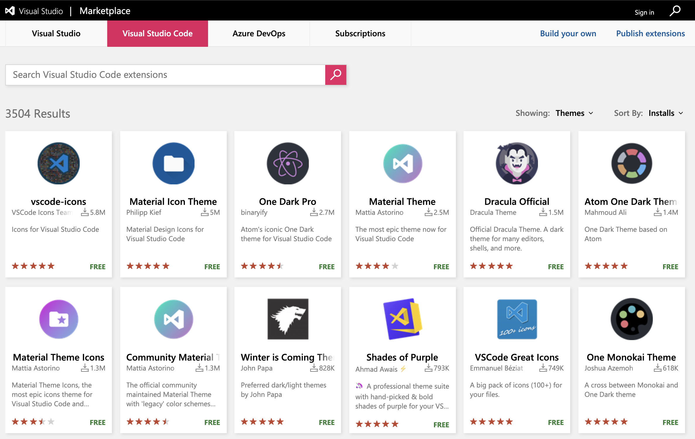
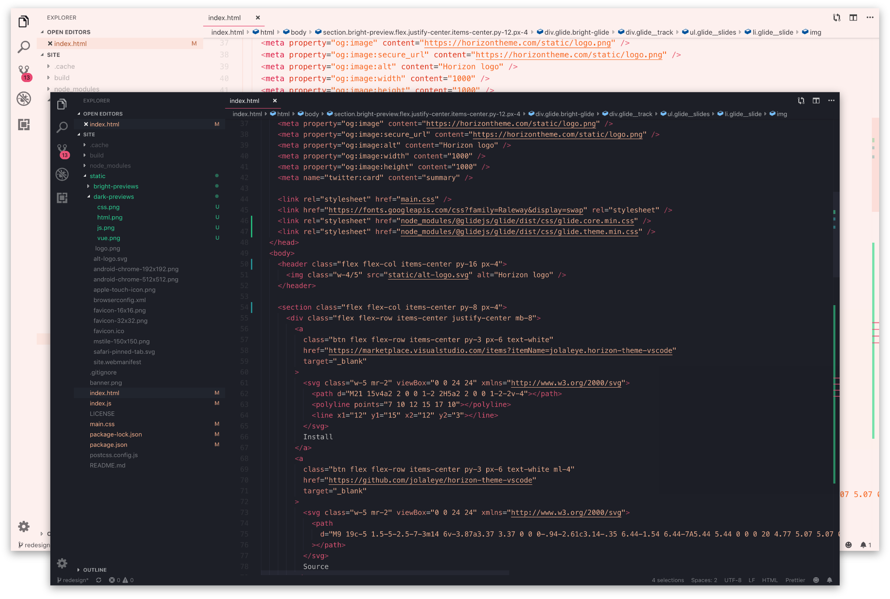

## Dúvidas do Sli.do

### o que significa os operadores << e >> ? exemplo: console.log(5 << 6)
Operadores bit-a-bit realizam as operações em representações binárias, mas retornam valores numéricos no padrão Javascript.
Ver mais: [Operadores bit-a-bit](https://developer.mozilla.org/pt-BR/docs/Web/JavaScript/Reference/Operators/Bitwise_Operators)

### Temas/Cores VSCode

*[catálogo de temas](https://marketplace.visualstudio.com/search?target=VSCode&category=Themes&sortBy=Installs)*

*[tema que eu uso - Horizon](https://marketplace.visualstudio.com/items?itemName=jolaleye.horizon-theme-vscode)*

----

### Exercício
1. Vamos escrever um programa que receba um número. Se o número for múltiplos de 3 o console imprimirá a palavra “Fizz”. Se for múltiplo de 5 mostraremos “Buzz”. Agora, se ele for múltiplo de 3 e 5 mostre “FizzBuzz”.

2. João, Pescador, comprou um microcomputador para controlar o rendimento diário de seu trabalho. Toda vez que ele traz um peso de peixes maior que o estabelecido pelo regulamento de pesca do estado de São Paulo (50 quilos) deve pagar uma multa de R$ 4,00 por quilo excedente. João precisa que você faça um programa que leia a variável peso (peso de peixes) e verifique se há excesso. Se houver, gravar na variável excesso e na variável multa o valor da multa que João deverá pagar. Caso contrário mostrar tais variáveis com o conteúdo ZERO.

3. Escreva um programa que pergunte a quantidade de km percorridos por um carro alugado pelo usuário, assim como a quantidade de dias pelos quais o carro foi alugado. Calcule o preço a pagar, sabendo que o carro custa 60,00 reais por dia e 0,15 centavos por km rodado.

----

### Extras

toFixed - https://developer.mozilla.org/pt-BR/docs/Web/JavaScript/Reference/Global_Objects/Number/toFixed

parseFloat - https://developer.mozilla.org/pt-BR/docs/Web/JavaScript/Reference/Global_Objects/parseFloat

parseInt - https://developer.mozilla.org/pt-BR/docs/Web/JavaScript/Reference/Global_Objects/parseInt